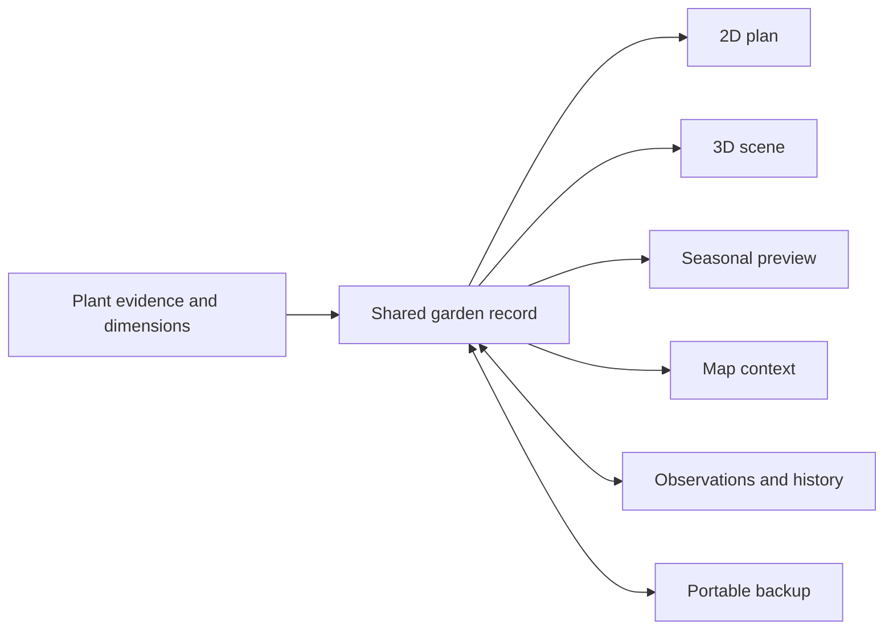

# veggie.farm — a garden to return to

[](https://github.com/categori-se/veggie-farm/actions/workflows/community.yml?query=branch%3Amain)

veggie.farm connects plant knowledge to a garden you can design, tend and remember. Explore gardening guides and seasonal tools, then use Garden Planning Studio to arrange beds and plants in synchronized 2D/3D views and keep plans and observations over time. It is open source, running on AWS, and initially focused on Massachusetts gardeners.

**[Try Garden Planning Studio](https://studio.veggie.farm)** · **[Explore veggie.farm](https://veggie.farm/)** · **[View the visual walkthrough](docs/user-guide/README.md)** · **[Builder image kit](docs/evidence/builder-images-2026-09-30.md)** · **[Browse source](https://github.com/categori-se/veggie-farm)** · **[Build / AWS evidence](#aws-and-coding-agent-evidence)**

**One garden record, many views:** plant data supplies the dimensions and identity shared by the plan, procedural 3D scene, seasonal preview and saved garden. Start with a few plants, try an arrangement and follow your curiosity.


**See the whole garden:** walk among beds and plantings in 3D, with buildings and trees providing site context.


**Inspect one planting:** compare its 2D footprint and procedural 3D form alongside seasonal planning controls. Both screenshots show the Berkshire Botanical Garden public example, an incomplete illustrative reconstruction.

## From concept to working application

veggie.farm is one of several project concepts I have carried in my head for years. I had registered the domain and imagined what it might become, but it had never turned into a real application. Discovering AWS Zero to Shipped on September 21, 2026 gave me the catalyst to finally build it.

I love gardening, but over the years I have relied on more trial and error than I would like. Looking online for help often means working through pages crowded with ads and trying to distinguish general advice from information backed by data and research. I built veggie.farm for more immediate access to source-linked plant information, a place to explore how it applies to my own garden, and records that help me track what happens over time. During the challenge, that idea became an integrated gardening resource and editable garden plan, drawing on open-source software and my experience with data, mapping and visualization.

**The hackathon gave me the push to turn something I had imagined into something people can actually use.** The [personal story](src/about/index.md) explains the motivation; the dated delivery records below document the build and public application.

## Try a small garden

**Primary demo:** [studio.veggie.farm](https://studio.veggie.farm/) · **No login:** Start with a 4 × 8 bed · **Fallback and access evidence:** [judging access](docs/evidence/judging-access.md).

1. Open Studio, open the **•••** garden menu beside **Save**, and choose **Start with a 4 × 8 bed**. No account or home address is required.
2. Name or resize the bed, choose plants and inspect their spacing and dimensions.
3. Compare the same garden in 2D and 3D.
4. Change the date to explore the seasonal preview.
5. Save, reload and download a JSON backup. Try restoring it in a separate empty browser profile.

The [visual guide](docs/user-guide/README.md) follows the journey with light and dark screenshots. The 3D view requires WebGL. Local drafts stay in the browser until explicitly uploaded or exported; keep a backup before clearing browser storage.

## Technical Innovation & Originality

**One garden record, many views.** Beds, plant identities, positions, dimensions and dates belong to a shared garden model. A tomato's plant record supplies its planning dimensions; placing it adds a bed, position and rotation. Those records drive its 2D footprint, 3D representation, date preview, geographic placement and persistence. Editing and restoring the garden preserve the relationships between those views.

> **Procedural 3D plant library** — Studio generates dimensionally scaled 3D representations of crops, flowers, shrubs and trees directly from plant records, with deterministic plant archetypes, gardener-authored size scenarios and procedural fallbacks. An optional model catalog supports separately hosted licensed GLB assets. See [src/lib/plants/](src/lib/plants/), [tests/plantVisuals.test.mjs](tests/plantVisuals.test.mjs), and [the model catalog](src/data/api/v1/collections/models/items.json).

The [starter collection of 50 common-garden plant profiles](docs/architecture/common-plant-shapes.md) makes this concrete: plant-specific dimensions and visual specifications use seven shared procedural families. Planning scale comes from the records. Optional size scenarios interpolate between gardener-specified dates and sizes; a planting date alone does not predict growth. These are schematic representations, with reusable source definitions; photographs and optional licensed models remain separately hosted.

The contribution is the integrated application: plant information becomes planning geometry with an identity and history that can be inspected across views. Existing libraries, public datasets and visualization research provide the foundations.



### Evidence becomes decisions

An Extension benchmark, an imported catalog value, a modeled shadow and a gardener's observation answer different questions. The data design preserves their sources and roles so a planning decision can be traced back to its assumptions. The repository contains [165 normalized horticultural evidence entries from seven reviewed Cooperative Extension snapshots](src/data/horticultural-evidence.json), alongside separately labeled planning profiles and archived open records.

MassGIS provides Massachusetts geographic context for locating a garden within its wider site. Opt-in NWS forecasts provide weather context, while NOAA solar equations support modeled sunlight scenarios. Private notebook observations record what the gardener saw. Read the [garden and GIS model](docs/studio-data-model.md), [evidence design](docs/architecture/reusable-plant-data.md) and [sunlight method](docs/architecture/seasonal-sunlight.md) for how these pieces connect.

## Community Impact

Massachusetts and New England home gardeners are the first community I am building for. A no-account practice garden lets someone explore without sharing an address; browser-local plans and portable JSON backups let them keep their work. The resource pages and spatial tools bring public plant, weather and geographic information closer to the scale of a bed and a season.

Other builders can inspect and extend the open-source core, source-linked data, procedural plant structures and tests. The [builder walkthrough](https://github.com/categori-se/veggie-farm/blob/main/docs/building/README.md) follows the integration through a runnable example. Massachusetts is the starting geography; adapting the system elsewhere requires appropriate local data and horticultural review.

I want to raise awareness of what open-source software makes possible and welcome people with limited coding experience into the developer community. veggie.farm is a fun invitation to experiment: connect an AI agent to AWS, find and visualize data around something you care about, and adapt a version for your own records and work. The open source, builder walkthrough and [agent connection guide](docs/architecture/codex-aws.md) provide a starting point. You can learn as you build, review access and costs, test changes and share what you learn. That is the spirit in which I want to encourage people to “vibe code” their ideas to life.

### Built with a generous community

I could build quickly because others had shared extraordinary building blocks. Observable Framework, D3 and Three.js support the interactive pages and graphics. MassGIS, NOAA/NWS, Cooperative Extension specialists and horticultural researchers provide public knowledge and methods. Model creators and visualization developers helped me imagine what the garden could become.

The documented inspirations include Dan Bridges, Christoph Pahmeyer, Claudio Esperança and Tom van Tilburg; their work and its relationship to this project are linked in the [sunlight and visualization notes](docs/architecture/seasonal-sunlight.md#basis-and-inspiration). The [acknowledgments](ACKNOWLEDGMENTS.md) distinguish dependencies, data, research and inspiration. Publishing the community core, reusable plant structures, tests and explanations is one way of returning some of that value.

## Implementation Quality

Verification follows a garden through editing, save/reload and export/reimport. Automated behavior tests, plant/source validation, citation checks and public-source privacy checks complement real-browser acceptance. [Dated hosted checks](docs/evidence/hosted-browser.json) exercise a synthetic garden on desktop and mobile; the [GitHub CI record](docs/evidence/github-verification.json) identifies the published source snapshot it verified.

[CI on the September 28 main merge commit](https://github.com/categori-se/veggie-farm/actions/runs/36397381023) passed 443 application tests, seven notice tests, data validation and the build. The [exact-commit record](docs/evidence/main-ci-2026-09-28.json) identifies what ran; the badge above follows the latest main workflow. Hosted guide checks verified seven screenshot pairs at desktop and mobile widths in both themes. These results and their scope are recorded in the deployment update below; local source verification and hosted acceptance remain separately identified.

## AWS and coding-agent evidence

S3 and CloudFront deliver the public application. Optional account services use Cognito, API Gateway and Lambda with private S3 records and server-side ownership/revision checks. Codex assisted implementation, diagnosis, testing and deployment verification; I directed the work, reviewed results and authorized publication.

The [project timeline](docs/evidence/project-timeline.md) separates the owner’s origin account, earlier inputs and dated publication evidence.

The [build evidence pack](docs/evidence/README.md) brings together the September 22 restricted agent-controlled AWS console inspection, the September 25 authenticated official AWS MCP Proxy/managed MCP Server stack read, development records and dated CI/browser observations. The [September 28 deployment update](docs/evidence/deployment-update-2026-09-28.md) documents continued agent-driven AWS SDK delivery, conditional S3 writes, completed CloudFront invalidation and hosted hash/browser verification. Authentic console and interface screenshots are hosted separately.

The site's About section links the [documented build and agent usage](src/about/build-evidence.md); [dated hosted verification](docs/architecture/build-evidence.json) supplies additional observations. The [competition rules](https://builder.aws.com/build/hackathons/e83e84e5-4f4c-383b-bbe9-4a15ac195d55/zero-to-shipped?tab=rules) weight innovation, implementation, impact and storytelling equally at 25% each. Builder project publication and event submission require separate verification; this repository does not certify organizer acceptance. To use your own account, see [Connect Codex to AWS](docs/architecture/codex-aws.md).

## Design → Tend → Remember → Grow

Make a plan, go outside, observe what happens and record it. Return next season with more context and better questions. The software helps connect those moments while leaving room for the weather, the site and the surprises of a living garden.

There is now a garden I can return to—both outside and online.

---

## Build on veggie.farm

Observable Framework builds the resource site and Studio; the browser owns editable garden geometry and view state. Start with the [architecture](docs/architecture.md), [Studio workflow](docs/studio-workflow.md), [garden data model](docs/studio-data-model.md) and [sharing boundaries](docs/architecture/open-core-boundary.md).

### Current scope and limitations

| Area | Implementation and limits |
| --- | --- |
| Gardening resource and Studio | Live plant guides, seasonal tools, bed/plant editing, 2D/3D and geographic context. Public-garden examples remain incomplete studies. |
| Persistence | Browser save/reload, JSON backups, optional account copies and reviewed shared collections. Notebook observations remain private; browser storage can be cleared. |
| Plants and environment | Source and structure validation does not establish every imported value. Procedural forms and authored size scenarios are planning representations, not biological simulations. Forecasts and modeled sunlight do not measure soil or establish surveyed geometry. |
| Evidence integration | Source-linked guidance is implemented. The Trefle adapter is tested offline; live enrichment, automatic taxonomy reconciliation and conflict resolution remain pending. |
| Release checks | Local source candidates and deployed changes have separate dated records. The September 28 candidate retained five existing unrelated link warnings and two documented tooling-only notice gaps. |
| Outcomes | Development included user run-throughs and feedback, synthesized into personas. Measured usability rates, adoption, yield improvements and environmental outcomes have not been established. |

### What I’m learning next

User run-throughs and feedback during development helped shape the personas used to refine the app. I want more people to try it with their own gardening questions, suggest features and help guide the next changes. The [prepared usability exercise](docs/evidence/gardener-usability.md) offers a structured way to extend that feedback through the choose, edit, save, reload and backup-recovery journey. See [data review status and coverage](docs/architecture/reusable-plant-data.md) for what has been checked and what remains uncertain.

### Run locally

Use Node 24.18.0 and npm 11.16.0 (see `.nvmrc` and the lockfile). Python 3 is needed for the optional notice regression suite (`npm run test:notices`):

```sh
npm ci --ignore-scripts
npm run build:dependency-notices
npm run dev
```

Open the preview URL printed by Observable, then `/studio` for the planner. Try the [bounded account sandbox](src/demo.md), start a practice garden or import `data/demo/community-garden.json` with Studio's backup import control. The fixture is synthetic, uses local inch coordinates and contains no address, parcel ID or geographic location.

```sh
npm test
npm run validate:data
npm run validate:plants
npm run build
```

Build output is `dist/`. The public build uses only bundled community inputs; no AWS account, private repository, database, map token or raw dataset is required. Browser libraries may be fetched during Observable builds. A browser dependency hash gate detects upstream drift; do not rewrite it blindly to silence a failure. Optional map/forecast/soil lookups require their public services. The local planner does not require those lookups.

### Where things live

| Directory | Purpose |
| --- | --- |
| `src/content`, `src/tools`, `src/plants` | Articles, seasonal/decision tools and plant discovery |
| `src/components`, `src/styles` | Shared UI and Studio rendering |
| `src/lib/plants` | **Procedural 2D/3D plant visualization, archetypes and geometry generation** |
| `src/data/api/v1/collections/models` | **Metadata catalog for optional licensed 3D plant models** |
| `src/lib/garden`, `src/lib/spatial` | Garden state, persistence, geometry and interchange |
| `src/lib/environment`, `src/lib/recommendations` | Environmental observations and evidence-based rules |
| `src/lib/account` | Optional public clients and deployment-selected persistence |
| `data/demo`, `data/reference` | Independent examples and data provenance |
| `scripts`, `tests` | Build, safety checks and tests |

The community catalog uses generic crop guides and botanical references. Partner-specific descriptions and photographs are not redistributed. Unknown cultivar facts remain unknown. Curated public-garden geometry and source records retain lineage. All media files, raw GIS/imagery, credentials and user projects belong outside source control. See [data sources](data/reference/datasets.json).

[Open-core boundary](docs/architecture/open-core-boundary.md) · [extension contracts](docs/architecture/extension-contracts.md) · [contributing](CONTRIBUTING.md) · [security](SECURITY.md).

Original code is [GPL-3.0-only](LICENSE); [NOTICE](NOTICE.md) describes separate content/asset terms and outstanding review. Monetization focuses on optional managed hosting, synchronization, team administration, premium integrations and processing. There is no artificial limit on local projects or portable backups.

This is the public community source distribution. Private garden data, media and operational records remain outside it.

No media files are included in this repository. Photographs, illustrations, fonts and 3D model files belong on separately operated storage; see [optional media](docs/architecture/media.md). Core planning uses procedural shapes without them.

### Acknowledgments and licensing

See [software acknowledgments and licenses](docs/licenses/README.md) for upstream credits, complete collected dependency notices, remaining gaps and [warranty/liability terms](docs/licenses/PROJECT-RIGHTS.md). The project integrates existing software and AWS configuration; it does not claim ownership of upstream components.

### Maintain, extend and deploy

[What the core offers and how to extend it](docs/architecture/extension-walkthrough.md) · [Studio paths/subdomains/components](docs/architecture/studio-integration.md) · [Protected two-repository workflow](docs/architecture/community-workflow.md) · [AWS deployment guide](examples/aws/DEPLOYMENT.md). Install local hooks with `npm run hooks:install`; run `npm run verify:community` before pushing. Source verification checks runtime/browser notices and the bounded source-only tooling policy. No remote or AWS action is part of a normal build.

### Your deployment, your information

The images, 3D model files and deployment-specific datasets used by veggie.farm are separately managed private hosting inputs, not bundled with this repository or granted under its source-code license. A public link does not itself grant permission to copy or reuse them. Bundled community examples and individually licensed open data retain their stated terms. Self-hosters supply, license, secure and maintain their own media, data and account services; the core works with its documented community fixtures and procedural shapes.

For guided setup after creating your own static stack, run `npm run setup:deploy`. It asks for your stack outputs and creates an external private configuration directory and next-step guide. It makes no AWS calls, creates no cloud resources and never overwrites an existing directory. Start with the [AWS deployment guide](examples/aws/DEPLOYMENT.md).

See [reviewed 3D source candidates and structural-plant priorities](docs/architecture/3d-model-sources.md). No third-party models were added by this review.

[Garden GIS layers and shared 2D/3D records](docs/architecture/garden-layer-model.md) · [Studio navigation and walking](docs/architecture/studio-navigation.md).
