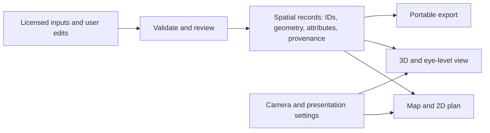

# Garden layers and shared spatial records

Studio follows a layered GIS model: records hold geometry, attributes and
provenance; the map, 2D plan and 3D scene are presentations of those records.
Camera movement, visibility, styling and a rendered tree mesh must not rewrite
an observation or a planting plan.

## What is implemented

The portable dataset has four collections, defined in
[`gardenFeatureCollections.js`](../../src/lib/spatial/gardenFeatureCollections.js).
The editor can present finer thematic groups without changing storage IDs.

| Stored collection | Editor themes | Geometry and meaning |
| --- | --- | --- |
| `parcels` | Garden boundary and reference extent | Polygon/MultiPolygon; source boundaries remain distinct from a planned bed |
| `site` | Paths, structures, trees, hedges, vegetation, water and utilities | Points, lines and polygons; retain the feature category and source geometry |
| `beds` | Bed placement and dedicated bed planning | Polygon/MultiPolygon; plant placements refer to their bed |
| `plants` | Individual crop/plant placements | Point/MultiPoint; keep botanical identity separate from an illustrative model |

[`gardenFeatureVocabulary.js`](../../src/lib/spatial/gardenFeatureVocabulary.js)
defines category-to-layer rules and style hints. Tree centers are points with
crown attributes; a crown silhouette is derived geometry. A path centerline
with an estimated corridor width is distinct from a surveyed path polygon.
The new structural palette supplies editable planned forms, not field-verified
species records. Its hedge mass is currently an area placeholder, not a line
tracing editor.

## Coordinates and identity

Geographic interchange uses longitude/latitude in CRS84. The garden editor
uses local inches with X east and Y south, based on a geographic origin when
one is supplied. Three.js displays local X as X, local Y as Z and height on
its vertical Y axis. The negative orbit heading matches the SVG plan rotation;
[`cameraOrientation.test.mjs`](../../tests/cameraOrientation.test.mjs) checks
handedness at seven headings. Do not fix a view problem by reflecting stored
coordinates.

The local approximation is for garden-scale work, not town-scale surveying.
Synthetic local-only gardens do not acquire a real location merely by being
exported; operators must establish the reference before treating coordinates
as geographic evidence. Keep feature IDs, bed relationships, source references,
confidence, geometry basis and measured-versus-estimated heights with the data.
The 3D renderer's fallback heights are illustrative, not measurements.

## Extend through existing boundaries

- Validate layered inputs with `validateGardenSpatialDataset` before
  `gardenSpatialDatasetToWorkspace` in `gardenFeatureCollections.js`.
- Use `gardenToInterchangeFeatureCollection` or `gardenToGeoJsonText` from
  [`spatialInterchange.js`](../../src/lib/spatial/spatialInterchange.js) for
  GIS exchange. GeoJSON export carries category, style hints and provenance.
- Use `stageGeoJsonImport` / `stageKmlImport` for review. Parsing an import
  does not authorize replacing canonical records or publishing private data.
- Preserve the [backup and hosting contracts](extension-contracts.md).
  Geographic interchange and a complete Studio backup serve different purposes.
- Keep provider credentials, downloaded imagery/models and private gardens
  in operator-managed storage; see [media](media.md).

## Design guidance and remaining work

The [GeoNode mapping guide](https://training.geonode.geosolutionsgroup.com/master/GN1/MAPPING_GEONODE.html)
separates datasets, styles, coordinate systems and map composition, and describes
layer ordering and feature-info queries. That is useful guidance for a future
compact layer panel. A WMS image is a rendered portrayal; it is not automatically
editable feature geometry.

The locally reviewed OpenGeo Studio layer ordering and geometry rendering code
also keeps layer identity apart from presentation, bounds tree traversal and
calculates fit bounds without changing source geometry. These are design
references; no OpenGeo code or general GIS platform was imported in this change.

Next UI work should group site themes into a compact layer list with visibility,
opacity, selection and explicit edit state. Visibility and permission to edit
must remain independent. The current tool rail and map settings cover portions
of this workflow; a generic reorderable layer catalog, WMS adapter, universal
polygon/hedge editor, topology engine and terrain-following walk are not yet
implemented. Any provider adapter must declare CRS/axis order, units, license,
query capability and bounded resource use before integration.
