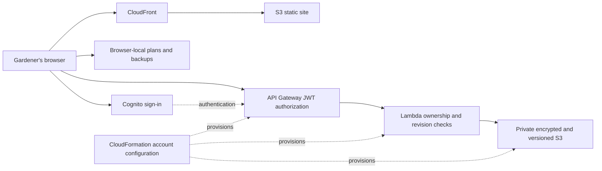

# Architecture and agent workflow

This diagram explains the implementation; it is not a screenshot or deployment receipt. The adjacent evidence records provide dated observations.

The community source includes the gardening resource and Studio, local planning, import/export, a bounded in-memory account demonstration and parameterized deployment templates. Operating credentials, private account services/data and separately hosted media are outside the public source. The simulation is not evidence of a real authenticated account session.

Codex was used during development to inspect code, implement changes, run automated and browser checks, and prepare and verify bounded releases with rollback records. Owner instructions set product direction, permissions and publication scope. GitHub CI supplies reproducible source checks. The September 22 console connection used agent-controlled Chromium with a temporary read-only federated session; the September 25 infrastructure check used AWS APIs. Neither is represented as continuous console access throughout development.

The code integrates Observable Framework, D3, Three.js and other existing software. See [acknowledgments](../../ACKNOWLEDGMENTS.md) and [licenses](../licenses/README.md). Original contributions include the application integration, configuration, planning and recovery workflows; no ownership of upstream software is claimed.
